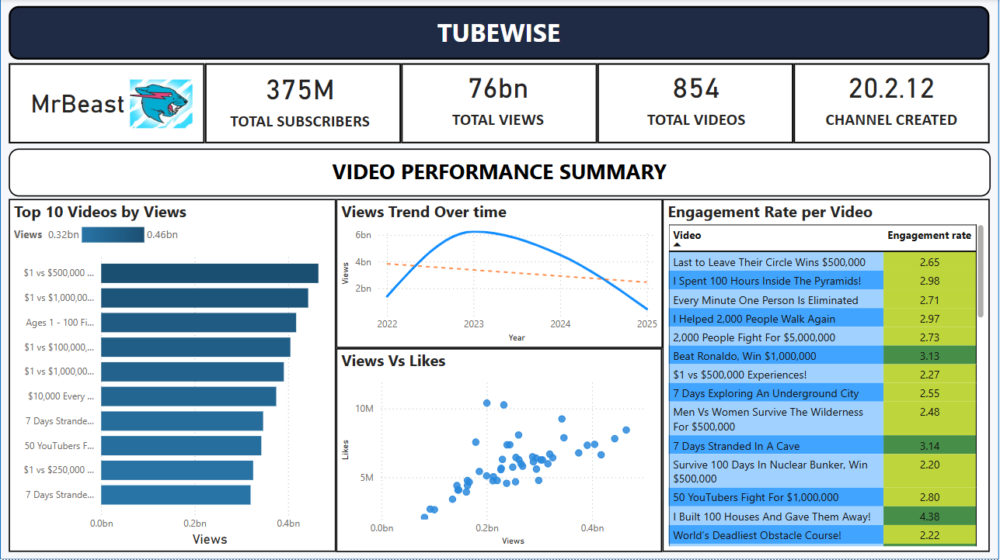

# 📊 YouTube Analytics Dashboard 🚀  

## 🎯 Project Overview  
This project automates the process of extracting YouTube channel data, storing it in Excel, and visualizing insights in Power BI. It provides a **dynamic, interactive dashboard** that updates automatically, allowing content creators and analysts to track **video performance, audience engagement, and growth trends** in real-time.  

---

## ⚡ Key Features  
✅ **YouTube Data Extraction** – Scrapes YouTube video statistics using Python.  
✅ **Automated Data Refresh** – Scheduled updates to keep data fresh.  
✅ **Data Cleaning & Processing** – Ensures structured and meaningful insights.  
✅ **Power BI Visualization** – Interactive dashboard with engagement trends, video performance, and subscriber growth.  
✅ **Conditional Formatting** – Highlights high/low engagement videos.  
✅ **Trend Analysis** – Moving average & views over time to track growth.  

---

## 🛠️ Tech Stack  
- **Python**: Data extraction (YouTube API/Web Scraping), automation.  
- **Excel**: Data storage & transformation.  
- **Power BI**: Data visualization & interactive dashboards.  
- **Schedule Library**: Automates daily updates.  

---

## 📊 Dashboard Preview  
Here's a preview of the interactive Power BI dashboard built in this project:
  
This dashboard displays key YouTube channel analytics like top-performing videos, views vs. likes, engagement rates, and more.
---

## 📊 Dashboard Insights  
🔹 **Top 10 Videos by Views** – Identifies the most popular content.  
🔹 **Views vs Likes** – Relationship between views & engagement.  
🔹 **Views Trend Over Time** – Growth trajectory of the channel.  
🔹 **Engagement Rate per Video** – Highlights high/low performing videos.  

---

## 🚀 How It Works  
### 1️⃣ Extract YouTube Data  
- Python script (`main.py`) fetches video stats.  
- Saves data to Excel (`YouTube_Data.xlsx`).  

### 2️⃣ Automate Data Refresh  
- **Schedule library** ensures daily updates.  
- Run `main.py` in the background for continuous updates.  

### 3️⃣ Visualize in Power BI  
- Connect **Power BI** to `YouTube_Data.xlsx`.  
- Use **DirectQuery** or manual refresh to update dashboards.  
- Apply **conditional formatting** for engagement highlights.  

---

## 🔥 Skills Gained  
✅ **Data Extraction & Automation**  
✅ **Data Cleaning & Transformation**  
✅ **Power BI Dashboards & Visualization**  
✅ **Data Analysis & Trend Identification**  
✅ **Python Scripting & Scheduling**  
✅ **End-to-End Workflow Automation**  

---

## 🚀 Setup & Usage  
### 1️⃣ Clone the Repository  
```sh
git clone https://github.com/dipanshumodi31/YouTube-Insights-PowerBI.git
cd YouTube-Insights-PowerBI
```
### 2️⃣ Install Dependencies
```sh
pip install pandas openpyxl schedule
```
### 3️⃣ Run the Script
```sh
python main.py
```
### 4️⃣ Open Power BI & Connect to YouTube_Data.xlsx
- Load the data.
- Refresh manually or enable DirectQuery for real-time updates.

---

## 🤖 Future Enhancements
🔹 SQL Database Integration for better scalability.
🔹 More KPIs (e.g., watch time, retention rate).
🔹 Web App Deployment for easy accessibility.

## 📩 Connect & Contribute
💡 Have ideas or improvements? Fork & contribute!
🚀 Let’s build smarter analytics together!

📌 Star this repo ⭐ if you find it useful!
Happy Analyzing! 📊🚀
